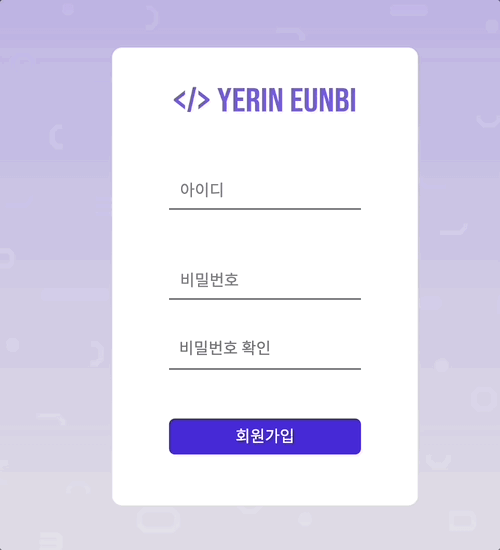

## ☑️ 유효성 검사

* 오늘 공부한 내용
* 어려웠던 내용
* 궁금한 내용과 부족한 내용 
* 느낀점
***

## ✨  오늘 공부한 내용

페어와 이틀동안 로그인 페이지를 제작해보았다.

아이디를 4글자 이상 작성시 '사용할 수 있는 아이디입니다' 라는 문구와 함께 녹색 박스가 나타나고, 아니라면 '아이디는 네 글자 이상이어야 합니다' 라는 문구와 함께 빨간 박스가 나타나게 된다.

비밀번호 재확인하여 일치 시 녹색 박스가 나타나고, 일치 하지 않으면 '비밀번호가 일치하지 않습니다' 라는 문구와 함께 빨간 박스가 나타난다.

<br>

## ✨  어려웠던 내용

css를 수정할 때 이러한 기능을 넣고 싶었다. 

```css
.events input:focus ~ label,
.events input:valid ~ label {
  top: -20px;
  /* left: 0; */
  color: #03e9f4;
  font-size: 12px;
}
```

👍 input:focus : input을 클릭하면 label이 움직이는 애니메이션.
transition을 이용하는 애니메이션이다.

👍 input:valid : input에 글을 써도 label이 위로 올라간 상태를 유지.

결과적으로,



다행히 생각했던 것과  비슷하게 구현이 되었다.

이 기능을 적용하기 위해 박스 높이를 줄이고, margin이나 padding을 수정 등 작은 포인트들을 수정하느라 시간이 꽤 걸렸다.

<br>

## ✨  부족한 내용

음.. 아쉬운 점이 많지만, 먼저 처음 시작 페이지에서 아이디 label 과 비밀번호 label의 간격을 좁혔어야 했다.

나중에 비밀번호를 입력할 때 아주 적절한 간격이 만들어지지만, 아무것도 입력하지 않았을 때 보면 그렇게.. 부드러운 디자인은 아닌 것 같다는 생각이 들었다.

💜 css를 공부할 겸 아쉬운 부분들 모두 수정해보도록 하겠습니다!

<br>

> ## 느낀점 👀

앞으로 이보다 더 발전있는 프로젝트를 만들고 싶다는 생각이 들었다.

**꾸준히 자기주도적 학습을 하고 새롭게 알게 된 내용을 바탕으로 TIL를 작성하겠습니다.** 😊