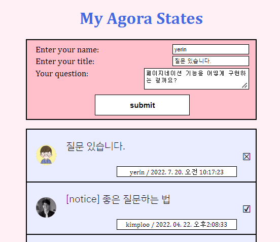

## ☑️ 나만의 아고라 스테이츠 만들기

* 오늘 공부한 내용
* 어려웠던 내용
* 궁금한 내용과 부족한 내용 
* 느낀점
***

## ✨  오늘 공부한 내용

지금까지 페어와 함께 프로젝트를 해결해 나갔다면, 
어제와 오늘! 이틀 동안 솔로 프로젝트를 해보았다.

**✅ 프로젝트 제목 : '나만의 아고라 스테이츠 만들기'**

아고라 스테이츠란 기술 관련 질문을 깃허브에 올리면 동기분들이나 크루분들이 답변해주는 커뮤니티이다.

이런 커뮤니티의 틀을 참고해서 기술 관련 질문을 등록하고, 등록 날짜, 제목 등 입력을 받아들이는 기능을 구현해야했다.

<br>

## ✨  어려웠던 내용

추가적으로 페이지네이션 기능, 현재시간 기능을 넣고 싶었다.

✅ 현재시간은 

```js
new Date().toLocaleString()
```

위와 같은 코드를 작성해주면 댓글을 submit 했을 떄 현재시간으로 댓글이 등록되는 것을 볼 수 있다.👍 




✅ 페이지네이션과 로컬스토리지 구현


### 로컬스토리지 코드
```js
const dataFromLocalStorage = localStorage.getItem("agoraStatesDiscussions");
if (dataFromLocalStorage) {
  data = JSON.parse(dataFromLocalStorage);
} else {
  data = agoraStatesDiscussions.slice();
}
```

```javascript
  // 로컬스토리지에 저장
  localStorage.setItem("agoraStatesDiscussions", JSON.stringify(data));
```

<br>

### 페이지네이션 구현 코드
```js
// 페이지네이션을 위한 변수
let limit = 10,
  page = 1;

// ul 요소에 data 배열의 모든 데이터를 화면에 렌더링합니다.
const ul = document.querySelector("ul.discussions__container");
render(ul, 0, limit);

const getPageStartEnd = (limit, page) => {
  const len = data.length - 1;
  let pageStart = Number(page - 1) * Number(limit);
  let pageEnd = Number(pageStart) + Number(limit);
  if (page <= 0) {
    pageStart = 0;
  }
  if (pageEnd >= len) {
    pageEnd = len;
  }
  return { pageStart, pageEnd };
};

const buttons = document.querySelector(".buttons");
buttons.children[0].addEventListener("click", () => {
  if (page > 1) {
    page = page - 1;
  }
  const { pageStart, pageEnd } = getPageStartEnd(limit, page);
  render(ul, pageStart, pageEnd);
});

buttons.children[1].addEventListener("click", () => {
  if (limit * page < data.length - 1) {
    page = page + 1;
  }
  const { pageStart, pageEnd } = getPageStartEnd(limit, page);
  render(ul, pageStart, pageEnd);
});

buttons.children[2].addEventListener("click", () => {
  localStorage.removeItem("agoraStatesDiscussions");
  data = agoraStatesDiscussions.slice();
  limit = 10;
  page = 1;
  render(ul, 0, limit);
});
```

📍 많은 복습이 필요한 것 같다. 의사코드를 작성하여 이해하고, 스스로 페이지네이션을 구현해보자.

<br>

## ✨  부족한 내용

페이지네이션 기능을 넣는데 시간이 많이 걸렸다.
스스로 이 기능을 넣을 때까지 코드 복습이 많이 필요하다고 느꼈다.

💜 css 부분은 많이 고쳐가며 실력 향상 시키기!

<br>

> ## 정리 👀

다음 솔로 프로젝트에서 스스로 만족스러운 제출이 될 수 있도록 열심히 복습해야겠다고 느꼈다.

**꾸준히 자기주도적 학습을 하고 새롭게 알게 된 내용을 바탕으로 TIL를 작성하겠습니다.** 😊