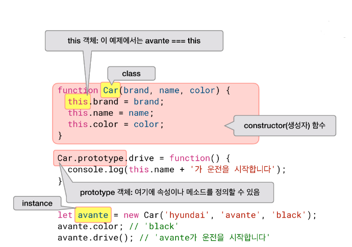
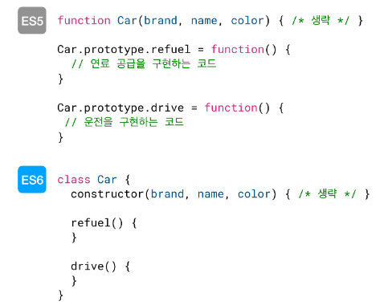

## 객체 지향 개요
> 데이터와 기능을 한곳에 묶어서 처리

> **클래스**라는 이름으로 **속성과 메서드가 하나의 "객체"라는 개념에 포함**

### 예시
```js
var man = {
name : 'Kurien',
favorite: function (thing) {
alert(this.name + '은(는) ' + thing + '을(를) 좋아합니다.');
  }
};
```

위 코드에서 객체 man은 name과 favorite 속성이 있고, favorite 속성은 함수 자료형이므로 favorite() 메서드라고 부른다.

this.name은 메서드 내에서 자기 자신이 가진 속성을 출력하기 위해서 사용되는데, 같은 man 객체에 존재하는 name을 불러온다는 뜻이다.

코드를 실행하게 되면 Kurien은(는) 게임을(를) 좋아합니다.라는 문장이 출력됩니다.

메서드 - "객체에 딸린 함수"
this - "인스턴스 객체"

***

## ☑️ 클래스와 인스턴스 블로깅

* 클래스
* 인스턴스
* new 키워드
* 생성자 함수
* ES5 클래스 작성 문법
* ES6 클래스 작성 문법
***

### ✔️ 클래스와 인스턴스



### ✔️ new 키워드

> 인스턴스를 만들 때 new 키워드를 사용

즉시 생성자 함수가 실행된다.
각각의 인스턴스는 클래스이 고유한 속성과 메서드를 갖게 된다.

### ✔️ 생성자 함수

> 객체지향 프로그래밍에서 인스턴스가 만들어질 때 실행되는 코드

참고로 생성자 함수는 return 값을 만들지 않는다.

(아래 그림에서 constructor 함수를 볼 수 있다)

### ✔️ ES5 클래스 작성 문법, ES6 클래스 작성 문법



ES5는 prototype이라는 키워드를 사용해야 메서드를 정의할 수 있습니다. Car 클래스에 메서드를 추가하기 위해서는 `Car.prototype.refuel`과 같이 `prototype`을 이용해야 한다.

ES6에서는 생성자 함수와 함께 class 키워드 안쪽에 묶어서 정의합니다. `refuel() {}`, drive() {}`와 같이 작성되어 있는 부분이다.

#### 정리

* 객체 : 클래스, 인스턴스, 속성을 포함
* 클래스 : 세부 사항(속성)이 들어가지 않은 청사진
* 인스턴스 : 클래스를 통해 만들어진 객체
* 생성자 : 생성자를 통해 세부 사항(속성) 넣기

<br>

## ☑️ 객체 지향 프로그래밍 (OOP) 블로깅

* 객체 지향 프로그래밍
* 캡슐화
* 추상화
* 상속
* 다형성
***

### ✔️ 객체 지향 프로그래밍

> 자바스크립트는 엄밀히 말해 객체 지향 언어는 아니지만, **객체 지향 패턴을 작성 가능**

✅ 객체 지향 프로그래밍의 주요 개념
> 캡슐화, 상속, 추상화, 다형성

### ✔️ 캡슐화

> 데이터와 기능을 **느슨하게** 결합

### ✔️ 추상화

> 내부 구현은 복잡해도 실제 노출되는 부분은 **단순하게** 만든다는 개념

### ✔️ 상속

> 기본 클래스(base class)의 특징을 파생 클래스(derived class)가 상속

### ✔️ 다형성

> **다양한 형태.**

> 예를 들어, 동물들이 말할 때 제각각 소리를 내는 것처럼, **객체 역시 똑같은 메서드라 하더라도, 다른 방식으로 구현될 수 있다.**

#### 정리

🔹 캡슐화는 코드가 복잡하지 않게 만들고, 재사용성을 높입니다.

🔹 추상화는 마찬가지로 코드가 복잡하지 않게 만들고, 단순화된 사용으로 변화에 대한 영향을 최소화합니다.

🔹 상속 역시 불필요한 코드를 줄여 재사용성을 높입니다.

🔹 다형성으로 인해 동일한 메서드에 대해 if/else if와 같은 조건문 대신 객체의 특성에 맞게 달리 작성하는 것이 가능해집니다.

<br>

## ☑️ 프로토타입 블로깅

* 프로토타입
* .prototype
* .__ proto __
* 클래스, 인스턴스, 프로토타입의 관계
***

### ✔️ 프로토타입

JavaScript는 프로토타입 기반 언어이다.

### ✔️ .prototype

* Object.prototype.constructor : 개체의 프로토타입을 만드는 함수를 지정

실제 출력 값을 보면

```js
class Human {
  constructor(name, age) {
    this.name = name;
    this.age = age;
  }

  sleep() {
    console.log(`${this.name}은 잠에 들었습니다`);
  }
}
```
Human.prototype.constructor === Human;을 출력했을 때와 동일한 결과를 얻을 수 있다.

```js
class Human {
  constructor(name, age) {
    this.name = name;
    this.age = age;
  }

  sleep() {
    console.log(`${this.name}은 잠에 들었습니다`);
  }
}

let kimcoding = new Human('김코딩', 30);
```

위 코드를 보면  Human 클래스의 인스턴스인 kimcoding을 볼 수 있다.

* Kimcoding.__ proto __ : 개체가 인스턴스화될때 프로토타입으로 사용된 개체를 가리킨다.

Human.prototype === kimcoding.__ proto __; 을 출력했을 때와 동일한 결과를 얻을 수 있다.

### ✔️ .__ proto __

> 접근하고자 하는 객체의 내부 속성인 [  [ Prototype ]  ](객체 또는 null)를 노출하는 접근자 속성(getter 및 setter 함수)이다.

__ proto __ 속성은 getter 및 setter 함수로 구성된 Object.prototype (en-US)의 간단한 접근자 속성이다.

<br>

☑️ **프로토타입 체인 블로깅**은 다음 포스트에 올리도록 하겠습니다.