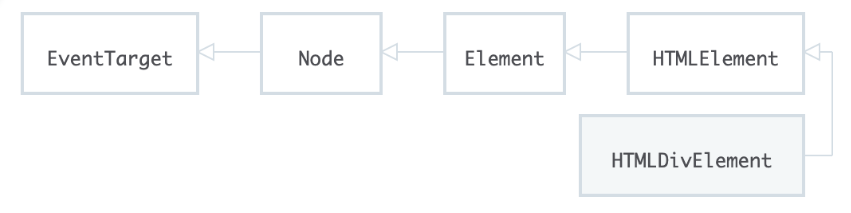

* 프로토타입 체인
* .prototype
* .__ proto __
* Object

***

### 프로토타입 체인

상속을 JS에서 구현할 때 프로토타입 체인 사용한다. 
extends와 super 키워드를 이용해 상속을 구현한다.

### .__ proto __

```js
let div = document.createElement('div');

div.__proto__.__proto__ // HTMLDivElement, HTMLElement
div.__proto__.__proto__.__proto__ // HTMLElement, Element
```

.__ proto __를 통해 계속 접근하면 상속 관계를 확인할 수 있다.


아래 그림을 통해 이해할 수 있을 것 같다.

### Object

실제  div 엘리먼트는,  HTMLDivElement라는 클래스의 인스턴스이다.



화살표 방향은 부모를 가리키고,
**EventTarget**의 부모로는, 모든 클래스의 조상인 **Object**가 존재합니다.