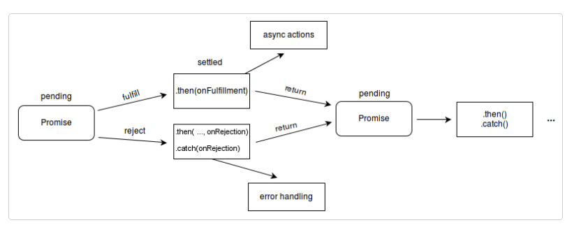

### Callback
> Async 제어

> 다른 함수에 인수로 전달된 함수이며 외부 함수 내부에서 호출되어 일종의 루틴이나 작업을 완료

### Promise

callback의 가독성을 높이기 위해 Promise 객체를 사용한다.

> Promise 객체는 비동기 작업이 맞이할 미래의 완료 또는 실패와 그 결과 값을 나타낸다.


#### ✔️ Promise의 세가지 상태

* 대기(pending): 이행하지도, 거부하지도 않은 초기 상태.
* 이행(fulfilled): 연산이 성공적으로 완료됨.
* 거부(rejected): 연산이 실패함.



그림을 보면 `Promise.prototype.then()`과 `Promise.prototype.catch()`가 있다.

#### Promise.prototype.then()

> `then()` 메서드는 Promise (en-US)를 리턴하고 두 개의 콜백 함수를 인수로 받는다.

> **Promise가 이행했을 때, 다른 하나는 거부했을 때를 위한 콜백 함수이다**

```js
p.then(onFulfilled, onRejected);

p.then(function(value) {
  // 이행
}, function(reason) {
  // 거부
});
```

#### Promise.prototype.catch()

>  Promise 거부된 사례만 반환하고 처리

```js
promise1.catch((error) => {
  console.error(error);
});
```
<br>

### async await
>Promise이지만 외부적으로 보이는 모습이 다른 형태이다.

```js
async function runAsync() {
  resetTitle();
  playVideo();

  await sleep(1000); //await 사용
  pauseVideo();
  displayTitle();

  await sleep(500);
  highlightTitle();

  await sleep(2000);
  resetTitle();
}
```

`function` 키워드 앞에 `async`만 붙여주면 되고 비동기로 처리되는 부분 앞에 `await`만 붙여주면 된다.

**다만, 몇 가지 주의할 점이 있다면** 
(1) `await` 뒷부분이 반드시 promise 를 반환해야 한다는 것과 
(2) async function 자체도 promise 를 반환한다는 것이다.

<br>

***

### 타이머 API 과제 하면서

#### Function.prototype.bind()

> bind() 메소드가 호출되면 새로운 함수를 생성

```js
func.bind(thisArg[, arg1[, arg2[, ...]]])
```

<br>

***

### Node.js

Node.js 에서는 JavaScript 코드 가장 상단에 require 구문을 이용하여 다른 파일을 불러온다.

```js
const fs = require('fs'); // 파일 시스템 모듈을 불러옵니다
const dns = require('dns'); // DNS 모듈을 불러옵니다
```

#### fs.readFile(path[, options], callback)

```js
fs.readFile('test.txt', 'utf8', (err, data) => {
```

☑️ **프로토타입 체인 블로깅**은 다음 포스트에 올리도록 하겠습니다:)

<br>
<br>

> ### 선배적 참견 시점 👀

#### "개발 세계는 숲이고, 개발자는 나무꾼과 같다."

오픈소스처럼 우리가 성장할 수 있도록 아낌없이 재료를 나눠준다라는 뜻에서 말씀하신 것 같다.

코드스테이츠에서 배우지 않은 것들로 회사에서 개발해야한다면 차피 Next.js, React Native도 자바스크립트 기반이기 때문에 조금만 공부하면 할 수 있다!

공부하면서 취준하면서 시간이 있다면 **사이트를 제작**하거나 *자기계발*하면 좋다.

#### 조언

❤️ git을 마스터해라!
❤️ 블로깅을 꾸준히해라!
❤️ 내가 짠 코드는 기록해라!

🚫 눈코딩 금지
🚫 혼자서만 개발하지 말기(동료들에게 질문, 스터디 이용)


**꾸준히 자기주도적 학습을 하고 새롭게 알게 된 내용을 바탕으로 TIL를 작성하겠습니다.** 😊