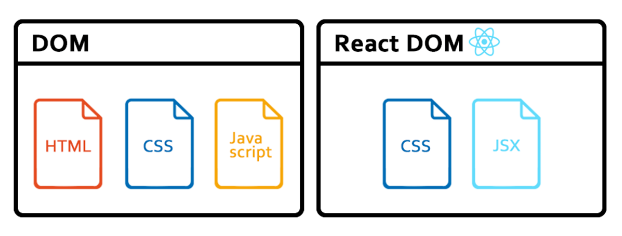

### React

> **프론트엔드 개발을 위한 자바스크립트 오픈소스 라이브러리**

* 라이브러리 : 다른 프로그램에서 호출하여 사용할 수 있도록 제공하는 일종의 함수 집합

리액트를 쓰는 이유에 3가지 특징이 있다.

    🔹 선언형
    🔹 컴포넌트 기반
    🔹 범용성

#### 선언형

html, css, js 파일을 각각 적는 것은 불편하다. 리액트는 다른 기술을 한 곳에 볼 수 있어 개발자가 코드만 보고도 실제 기능을 쉽게 상상할 수 있다.

#### 컴포넌트 기반

코드를 묶어둔 컴포넌트 단위로 구현되어 실제 기능을 쉽게 상상할 수 있다.
장점은 독립성, 재사용성에 효율적이다.
컴포넌트를 잘 만들어 놓으면 계속 재사용이 가능해진다는 것이다. 

* 최상위 컴포넌트는 Root이며, 트리 구조를 형상화하여 표현할 수 있다. 

#### 범용성
기존에 개발하던 코드를 일부만 고쳐서 어디에든 **유연**하게 적용할 수 있다.

리액트 네이티브와도 호환이 가능하다고 한다.

<br>

***

### JSX

> JavaScript를 확장한 문법

JSX는 JavaScript가 확장된 문법이지만, 브라우저가 바로 실행할 수 있는 JavaScript 코드가 아니다.
그래서 브라우저가 이해할 수 있는 JavaScript 코드로 변환하기 위해  **“Babel”** 을 이용한다

#### Babel

> JSX를 브라우저가 이해할 수 있는 JavaScript로 컴파일



React에서는 DOM과 다르게 CSS, JSX 문법만을 가지고 웹 애플리케이션을 개발할 수 있다.

즉, 한눈에 컴포넌트를 확인할 수 있게 되었다.

<br>

***

### React 시작하기

```js
npx create-react-app@latest 폴더이름
```

터미널에서 react 파일을 생성할 수 있다.

프로젝트를 브라우저에 실행하고 싶다면 아래 코드를 입력하면 된다.

```js
npm start
```

### React 파일

#### index.js

* src 폴더에 포함
* 메인 프로그램
* 여기에서 HTML 템플릿 및 JavaScript의 컴포넌트를 조합하여 렌더링하고 실제 표시

#### App.js

* src 폴더에 포함
* 컴포넌트를 정의하는 프로그램
* 실제로 화면에 표시되는 내용 등은 여기에서 정의

```js
return (<div className = "App"> ... 생략 ... </ div);

return <h1>Hello, {formatName(user)}!</h1>;
```

JSX형태로 나타낼 수 있다.

<br>

***

### JSX

#### JSX 규칙

```js
function Hello(){
    return <div>Hello!<div>
}

function HelloWorld(){
    return <Hello />
}
```

위 코드를 보면 HelloWorld 함수에서 Hello 함수를 리턴하고 있다.

```js
import { App } from './App';

ReactDOM.render(<App />, document.getElementById('root'));
```

위 코드는 index.js파일에서 App 컴포넌트를 root라는 id 값에 부착시킨다는 뜻이다.

즉, 위 코드를 실행하면 App.js가 실행될 것이다.

  **왜 jsx는 삼항연산자를 써야 할까?**
  if문은 변수에 넣지 못하기 때문에 변수에 넣을 수 있는 삼항연산자를 쓰면 편리하다.

<br>

> ### 마무리 👀

React를 처음 배워보는데, html을 따로 작성하지 않아서 매우 편리했다.
React에 익숙해지면 쉽게 웹사이트를 제작할 수 있을 것 같아서 좋았다.
