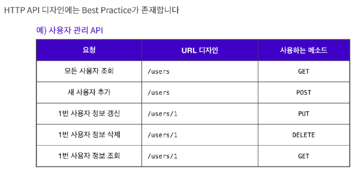

## ☑️ Client Server Architecture

> 리소스가 존재하는 곳과 리소스를 사용하는 앱을 분리시킨 것

## ☑️ 프론트엔드 vs 백엔드

> **프론트엔드엔드 개발자** : 사용자가 직접 눈으로 보고, UI를 클릭 또는 터치하는 등의 상호작용을 할 수 있는 앱을 주로 개발 

> **백엔드 개발자** : 사용자 눈에 직접 보이지 않게 뒤에서 작동하게 한다.

## ☑️ 클라이언트-서버 통신과 API

### ✔️ API

> 서버는 클라이언트에게 리소스를 잘 활용할 수 있도록 인터페이스를 제공해줘야 한다.

예를 들어 카페에서 서버(주인)는 "아메리카노 주문은 /americano로 요청하세요" 라는 **메뉴판**을 제공하는 것을 API라고 한다.

### ✔️ HTTP API 디자인 Best Practice

보통 인터넷에 있는 데이터를 요청할 때에는 HTTP 프로토콜을 사용하며, 주소(URL, URI)를 통해 접근할 수 있다.

HTTP 요청시 메서드를 지정하여 리소스와 관련된 행동(CRUD)을 지정할 수 있다.

📍 메서드 설명은 MDN "HTTP 요청 메서드"를 참고하면 된다!

## ☑️ 브라우저의 작동 원리 (보이지 않는 곳)

### ✔️ URL

> Uniform Resource Locator의 줄임말로, 네트워크 상에서 웹페이지, 이미지, 동영상 등의 파일이 위치한 정보

📍 **URL의 기본 요소** - scheme, hosts, url-path

### ✔️ URI

> Uniform Resource Identifier의 줄임말로, 일반적으로 URL의 기본 요소인 scheme, hosts, url-path에 더해 **query, fragment를 포함** 

📍 **query**는 웹 서버에 보내는 추가적인 질문

#### 🔹 명칭 

따라서, 'URL은 URI다.' 는 **참**, 
'URI는 URL이다.' 는 **거짓**

## ☑️ HTTP

### ✔️ HTTP Requests

> 클라이언트가 서버에게 보내는 메시지

#### 🔹 Start Line

> start line에는 요청이나 응답의 상태를 나타낸다. 항상 첫 번째 줄에 위치. 응답에서는 status line이라고 부른다.

#### 🔹 HTTP headers

> 요청을 지정하거나, 메시지에 포함된 본문을 설명하는 헤더의 집합.

* **General headers** : **메시지 전체에 적용**되는 헤더로, body를 통해 전송되는 데이터와는 관련이 없는 헤더

* **Request headers** : fetch를 통해 가져올 리소스나 클라이언트 자체에 대한 자세한 정보를 포함하는 헤더를 의미합니다. User-Agent, Accept-Type, Accept-Language와 같은 헤더는 **요청을 보다 구체화**. 
Referer처럼 컨텍스트를 제공하거나 If-None과 같이 조건에 따라 제약을 추가할 수 있다.

* **Representation headers** : 이전에는 Entity headers로 불렀으며, **body에 담긴 리소스의 정보(콘텐츠 길이, MIME 타입 등)를 포함**하는 헤더.

#### 🔹 empty line

> 헤더와 본문을 구분하는 빈 줄이 있다.

#### 🔹 body

> 요청과 관련된 데이터나 응답과 관련된 데이터 또는 문서를 포함. 요청과 응답의 유형에 따라 선택적으로 사용.

* 모든 요청에 body가 필요하지는 않다.
* **GET, HEAD, DELETE, OPTIONS**처럼 **서버에 리소스를 요청하는 경우**에는 본문이 **필요하지 않다**.
>  **POST**나 **PUT**과 같은 일부 요청은 **데이터를 업데이트**하기 위해 사용

### ✔️ HTTP Responses

> 서버가 클라이언트에게 보내는 메시지

#### 🔹 Status line

1. 현재 프로토콜의 버전(HTTP/1.1)

2. 상태 코드 - 요청의 결과 (ex. 200, 302, 404 등)

3. 상태 텍스트 - 상태 코드에 대한 설명

#### 🔹 HTTP headers

> 요청을 지정하거나, 메시지에 포함된 본문을 설명하는 헤더의 집합.

* **General headers**

* **Request headers** : 위치 또는 서버 자체에 대한 정보(이름, 버전 등)와 같이 **응답에 대한 부가적인 정보를 갖는 헤더**로, Vary, Accept-Ranges와 같이 상태 줄에 넣기에는 공간이 부족했던 추가 정보를 제공

* **Representation headers**

#### 🔹 empty line

> 헤더와 본문을 구분하는 빈 줄이 있다.

#### 🔹 body(payload)

* 모든 요청에 body가 필요하지는 않다.
* **201, 204**와 같은 상태 코드를 가지는 응답에는 본문이 **필요하지 않다**.

## ☑️ 브라우저의 작동원리 (보이는 곳) 

### ✔️ AJAX

> synchronous JavaScript And XMLHttpRequest의 약자로, JavaScript, DOM, Fetch, XMLHttpRequest, HTML 등의 다양한 기술을 사용하는 웹 개발 기법

 웹 페이지에 필요한 부분에 필요한 데이터만 비동기적으로 받아와 화면에 그려낼 수 있다는 것이 AJAX의 가장 큰 특징이다.

### ✔️ AJAX의 두 가지 핵심 기술

* JavaScript와 DOM
* Fetch

#### 🔹 Fetch
> Fetch는 사용자가 현재 페이지에서 작업을 하는 동안 서버와 통신할 수 있도록 한다.

JavaScript에서 DOM을 사용해 조작할 수 있기 때문에, Fetch를 통해 필요한 데이터를 **비동기적**으로 가져와 DOM에 적용시켜 **페이지를 이동하지 않아도** 기존 페이지에서 필요한 부분만 변경할 수 있다.

## ☑️ SSR vs CSR

### ✔️ SSR

> 웹 페이지를 브라우저에서 렌더링하는 대신에 **서버에서 렌더링**

서버에서 웹 페이지를 브라우저로 보내기 전에 **서버에서 완전히 렌더링했기 때문에** Server Side Rendering 이라고 한다.

웹 페이지의 내용에 데이터베이스의 데이터가 필요한 경우, 서버는 데이터베이스의 데이터를 불러온 다음, 웹 페이지를 완전히 렌더링 된 페이지로 변환한 후에 브라우저에 응답으로 보낸다.

### ✔️ CSR

> CSR은 SSR의 반대.
**클라이언트(웹 브라우저)에서 페이지를 렌더링**

서버는 웹 페이지를 렌더링하는 대신, 웹 페이지의 골격이 될 **단일 페이지(Single Page)와 JavaScript 파일**을 클라이언트에 보낸다.

웹 페이지와 함께 전달된 JavaScript 파일은 브라우저의 웹 페이지를 **완전히 렌더링 된 페이지로 바꿉니다.**

웹 페이지에 필요한 내용이 데이터베이스에 저장된 데이터인 경우, Fetch와 같은 API를 사용해 브라우저는 데이터베이스에 저장된 데이터를 가져와서 웹 페이지에 렌더링을 해야 한다.

📍 **SSR과 CSR의 주요 차이점: 페이지가 렌더링되는 위치**
