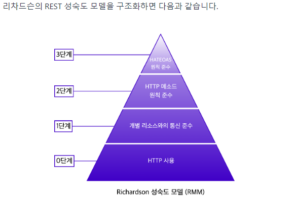
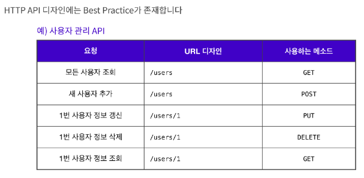

### ✔️ API

> 서버는 클라이언트에게 리소스를 잘 활용할 수 있도록 인터페이스를 제공해줘야 한다.

예를 들어 카페에서 서버(주인)는 "아메리카노 주문은 /americano로 요청하세요" 라는 **메뉴판**을 제공하는 것을 API라고 할 수 있다.

## ☑️ REST API

### ✔️ 개요

클라이언트와 서버가 HTTP 통신을 할 때(요청과 응답할 때), '제대로 보내고 받을 수 있는' 일종의 규약이 존재

> REST는 “Representational State Transfer”의 약자로, 웹에서 사용되는 데이터나 자원(Resource)을 HTTP URI로 표현하고, HTTP 프로토콜을 통해 요청과 응답을 정의하는 방식

## 🚩 REST API 디자인

우리는 메뉴판을 api로 예를 들었다.
**알아보기 쉽고 잘 작성된 메뉴판**이 필요한데, 이 역할을 API가 수행해야 하므로 모두가 잘 알아볼 수 있도록 작성하는 것이 중요하다.

### ✔️ REST 성숙도 모델 - 0단계

단순 HTTP 프로토콜을 사용

### ✔️ REST 성숙도 모델 - 1단계

어떤 리소스를 변화시키는지 혹은 어떤 응답이 제공되는지에 따라 각기 **다른 엔드포인트를 사용**, 적절한 엔드포인트를 작성하는 것이 중요

### ✔️ REST 성숙도 모델 - 2단계

CRUD에 맞게 적절한 HTTP 메서드를 사용하는 것에 중점

API를 작성할 때, REST 성숙도 모델의 2단계까지 적용하면 대체적으로 잘 작성된 API라고 할 수 있다.

* Read(GET)
* Create(POST)
* Update(PUT : 교체, PATCH : 수정)
* Delete(DELETE)

### ✔️ REST 성숙도 모델 - 3단계

📍 HATEOAS(Hypertext As The Engine Of Application State)라는 약어로 표현되는 하이퍼미디어 컨트롤을 적용

3단계의 요청은 2단계와 동일하지만, **응답에는 리소스의 URI를 포함한 링크 요소를 삽입**하여 작성

> ## 마무리 👀

React를 배우고 있는 시점에, Github 블로그를 Jekyll에서 Gatsby 기반으로 바꾸고 싶다는 생각이 들었다. 

그 이유는 Gatsby는 React와 GraphQL 기반으로 동작하는 정적 사이트 생성기이다. JavaScript 기반의 프레임워크인데, 

 Gatsby는 React를 이용한 컴포넌트 개발 환경 구성이고, 이 외에도 풍부한 플러그인 지원, 프리로드(preload) 등 자체적으로 성능 개선을 위한 다양한 방법을 제공하는 것이 마음에 들었다.

블로그 마이그레이션 대공사가 이루어질 것 같다. 😭

**꾸준히 자기주도적 학습을 하고 새롭게 알게 된 내용을 바탕으로 TIL를 작성하겠습니다.** 😊