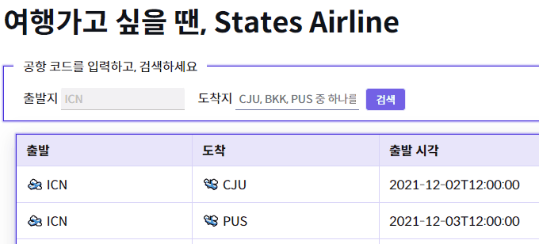

## State Airline 시작하기

### useEffect

```
useEffect(함수, []) // 처음만 실행
```

`useEffect(함수)`
두 번째 전달인자인 종속성이 없으면 첫번째 전달인자인 함수를 _______________ 실행한다.
* 처음 컴포넌트가 생성될 때
* props가 변경될 때
* state가 변경될 때

### promise

Promise `resolve()`에 있는 데이터를 접근하려면 `.then` 사용

예시: 

```js
let aa = new Promise((resolve) => {
    resolve("hi")
    .then()
})
```

<br>

## State Airline

### LoadingIndicator.js

```js
function LoadingIndicator() {
  return (
    
  );
}

export default LoadingIndicator;
```

`<LoadingIndicator />` 라는 로딩 화면 구현은 사용자에게 중요하다. 개발자라면 이 부분에 대해서 관대해지면 안된다. 구현해 주는 것이 좋겠다.


### Main.js
```js
 useEffect(() => {
    setIsLoading(true);
    getFlight(condition) //condition으로 newPromise의 flitered를 사용한다.
    .then(filter => {
      setFlightList(filter) //filighlist에 데이터를 담고
    })
    setIsLoading(false); // 로딩 끄기
  }, [condition])
```

`.then` 밖에 `setIsLoading(false);` 선언되어 있는데 실행은 되지만 `.then`이 끝날 때까지 기다리지 않기 때문에 `setIsLoading(false);`을 바로 실행이 된다.

그렇기 때문에 `setIsLoading(false);`을 `.then`안에 넣어줘야 하는 것이다.

**Main.js** 전체 코드는 이렇다.

```js
import Head from 'next/head';
import { useEffect, useState } from 'react';
import { getFlight } from '../api/FlightDataApi';
import FlightList from './component/FlightList';
import LoadingIndicator from './component/LoadingIndicator';
import Search from './component/Search';
import Debug from './component/Debug';
// 후반 테스트를 진행할 때 아래 import를 삭제합니다.

export default function Main() {
  // 항공편 검색 조건을 담고 있는 상태
  const [condition, setCondition] = useState({
    departure: 'ICN',
  });
  const [flightList, setFlightList] = useState([]);

  // 주어진 검색 키워드에 따라 condition 상태를 변경시켜주는 함수
  const search = ({ departure, destination }) => {
    if (
      condition.departure !== departure ||
      condition.destination !== destination
    ) {
      console.log('condition 상태를 변경시킵니다');

      // TODO: search 함수가 전달 받아온 '항공편 검색 조건' 인자를 condition 상태에 적절하게 담아보세요.
      setCondition({departure, destination})
    }
  };

  const filterByCondition = (flight) => {
    let pass = true;
    if (condition.departure) {
      pass = pass && flight.departure === condition.departure;
    }
    if (condition.destination) {
      pass = pass && flight.destination === condition.destination;
    }
    return pass;
  };

  global.search = search; // 실행에는 전혀 지장이 없지만, 테스트를 위해 필요한 코드입니다. 이 코드는 지우지 마세요!

  // TODO: Effeck Hook을 이용해 AJAX 요청을 보내보세요.
  // TODO: 더불어, 네트워크 요청이 진행됨을 보여주는 로딩 컴포넌트(<LoadingIndicator/>)를 제공해보세요.
  const [isLoading, setIsLoading] = useState(false);

  useEffect(() => {
    setIsLoading(true);
    getFlight(condition) //condition으로 newPromise의 flitered를 사용한다.
    .then(filter => {
      setFlightList(filter) //filighlist에 데이터를 담고
      setIsLoading(false); // 로딩 끄기
    })
  }, [condition])

  // TODO: 테스트 케이스의 지시에 따라 search 함수를 Search 컴포넌트로 내려주세요.
  return (
    <div>
      <Head>
        <title>States Airline</title>
        <link rel="icon" href="/favicon.ico" />
      </Head>

      <main>
        <h1>여행가고 싶을 땐, States Airline</h1>
        <Search onSearch={search}/>
        <div className="table">
          <div className="row-header">
            <div className="col">출발</div>
            <div className="col">도착</div>
            <div className="col">출발 시각</div>
            <div className="col">도착 시각</div>
            <div className="col"></div>
          </div>
          {/* <FlightList list={flightList.filter(filterByCondition)} /> */}
          {isLoading ? <LoadingIndicator /> : <FlightList list={flightList} />}
        </div>

        <div className="debug-area">
          <Debug condition={condition} />
        </div>
        
      </main>
    </div>
  );
}
```

### FlightDataApi.js

**Main.js**를 보면 `getFlight(condition)`는 아래와 같이 **FlightDataApi.js**에 있다.

```js
import { getFlight } from '../api/FlightDataApi'
``` 

### FlightDataApi.js

```js
import flightList from '../resource/flightList';
import fetch from 'node-fetch';

if (typeof window !== 'undefined') {
  // localStorage'에 정보를 저장
  localStorage.setItem('flight', JSON.stringify(flightList));
}

// filterBy = ()는 디폴트 값
export function getFlight(filterBy = {}) {
  // HINT: 가장 마지막 테스트를 통과하기 위해, fetch를 이용합니다. 아래 구현은 완전히 삭제되어도 상관없습니다.
  // TODO: 아래 구현을 REST API 호출로 대체하세요.

  let json = [];
  if (typeof window !== 'undefined') {
    json = localStorage.getItem('flight');
  }

  const flight = JSON.parse(json) || [];

  return new Promise((resolve) => {
    //filtered 배열이다
    const filtered = flight.filter((flight) => {
      let condition = true;
      if (filterBy.departure) {
        condition = condition && flight.departure === filterBy.departure;
      }
      if (filterBy.destination) {
        condition = condition && flight.destination === filterBy.destination;
      }
      return condition;
    });

    setTimeout(() => {
      resolve(filtered);
    }, 500);
  });
}

```

위 코드를 보면 우리는 **flightList.js**에서 데이터를 가져오고 있다.

<br>

**이제 하드코딩 된 flightList JSON을 사용하지 않고
REST API를 호출해 똑같이 실행해보겠다.**

#### 1.

내가 써 본 방법은 두 가지 이다. 

첫번째로는 어차피 출발지는 `ICN`으로 고정되어 있기 때문에 destination만 검색해도 결과값을 얻을 수 있다.


```js
  // 1.
  let url = `http://ec2-13-124-90-231.ap-northeast-2.compute.amazonaws.com:81/flight?departure=ICN`
  
  if(filterBy.destination){
    url = url + "&destination=" + filterBy.destination
  }

  return fetch(url)
  .then(resp => resp.json())
```

기존 endpoint에서 출발지를 추가해서 변수 `url`을 만들고, 조건문으로 도착지를 추가해주면 된다.

마지막에 StatesAirline 서버에서 항공편 정보를 요청(fetch)을 하면 된다.

#### 2.

```js
  //2
  let emstring = ''
  if (filterBy.departure) {
    emstring = emstring + `departure=${filterBy.departure}&`
  }
  if (filterBy.destination) {
    emstring = emstring + `destination=${filterBy.destination}`
  }
  let url = `http://ec2-13-124-90-231.ap-northeast-2.compute.amazonaws.com:81/flight?${emstring}`
  
  return fetch(url)
  .then(resp => resp.json())
```

**1.** 보다 더 복잡하다.
`emstring`이라는 빈 문자열에 출발지와 도착지를 추가하면 된다.

그리고 `url` 변수에 출발지와 도착지를 넣은 `emstring`를 추가하면 된다.

마지막은 똑같이 StatesAirline 서버에서 항공편 정보를 요청(fetch)하면 된다.

**Main.js**에서 `useEffect()`를 사용한 이유이다.