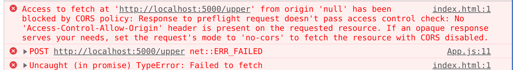
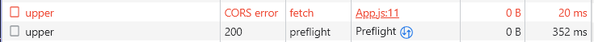
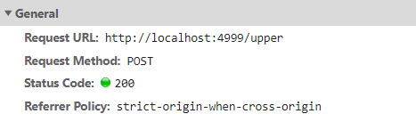

API 서버는 프론트엔드 개발자도 구현할 줄 알아야 한다. 새로운 서비스를 만들려고 해도, 필요한 데이터를 저장하거나 불러오는 기본적인 API 서버를 구현할 수 없다면 아무런 동적 활동을 할 수 없는 클라이언트만 구현될 수 밖에 없다. 

### SOP가 생겨난 이유

SOP은 애초에 다른 사이트와의 리소스 공유를 제한하기 때문에 해킹 등의 위협에서 보다 더 안전해질 수 있다. 모든 브라우저에서 기본적으로 사용하고 있는 정책이다.

### CORS
**Cross-Origin Resource Sharing의 줄임말로 교차 출처 리소스 공유를 뜻한다.**

 추가 HTTP 헤더를 사용하여, 한 출처에서 실행 중인 웹 애플리케이션이 다른 출처의 선택한 자원에 **접근할 수 있는 권한을 부여**하도록 브라우저에 알려주는 체제이다.

#### ✔️ CORS 동작 방식

1. 프리플라이트 요청 (Preflight Request)
    단순 요청 (Simple Request)이라는 것은 프리플라이트 요청(Preflight Request)을 생략하는 요청이다.
2. 인증정보를 포함한 요청 (Credentialed Request)
    이 경우에는 프론트, 서버 양측 모두 CORS 설정이 필요하다.

<br>

### Node.js HTTP

Node.js로 간단한 HTTP 서버를 만들 경우, 다음과 같이 응답 헤더를 설정해줄 수 있다.

```js
const http = require('http');

const server = http.createServer((request, response) => {
// 모든 도메인
  response.setHeader("Access-Control-Allow-Origin", "*");

// 특정 도메인
  response.setHeader("Access-Control-Allow-Origin", "https://codestates.com");

// 인증 정보를 포함한 요청을 받을 경우
  response.setHeader("Access-Control-Allow-Credentials", "true");
})
```
<br>

### Express

Express 프레임워크를 사용해서 서버를 만드는 경우에는, cors 미들웨어를 사용해서 보다 더 간단하게 CORS 설정을 해줄 수 있다.

```js
const cors = require("cors");
const app = express();

//모든 도메인
app.use(cors());

//특정 도메인
const options = {
  origin: "https://codestates.com", // 접근 권한을 부여하는 도메인
  credentials: true, // 응답 헤더에 Access-Control-Allow-Credentials 추가
  optionsSuccessStatus: 200, // 응답 상태 200으로 설정
};

app.use(cors(options));

//특정 요청
app.get("/example/:id", cors(), function (req, res, next) {
  res.json({ msg: "example" });
});
```

**Express로 구현한 서버가 Node.js HTTP 모듈로 작성한 서버와 다른 점:**

1. 미들웨어를 추가할 수 있다.
2. 라우터를 제공한다.

#### ✔️ 미들웨어를 사용하는 상황

1. POST 요청 등에 포함된 body(payload)를 구조화할 때(쉽게 얻어내고자 할 때)
2. 모든 요청/응답에 CORS 헤더를 붙여야 할 때
3. 모든 요청에 대해 url이나 메서드를 확인할 때
4. 요청 헤더에 사용자 인증 정보가 담겨있는지 확인할 때 

<br>

### HTTP 트랜잭션 해부

[[HTTP 트랜잭션 해부 공식 문서]](https://nodejs.org/ko/docs/guides/anatomy-of-an-http-transaction/)

Node.js HTTP 처리 과정을 잘 이해하기 위해 위 공식 문서를 꼭 읽어봐야 한다. **Mini Node Server**라는 과제를 하면서 공식 가이드에서 중요한 점을 살펴보자.

```js
let body = [];
request.on('data', (chunk) => {
  body.push(chunk);
}).on('end', () => {
  body = Buffer.concat(body).toString();
  // 여기서 `body`에 전체 요청 바디가 문자열로 담겨있습니다.
});
```

각 `'data'` 이벤트에서 발생시킨 chuck는 `Buffer`이다. 이 **chunk가 문자열 데이터**라는 것을 알고 있다면 이 데이터를 배열에 수집한 다음 `'end'` 이벤트에서 이어 붙인 다음 문자열로 만드는 것이 가장 좋다.

#### basic-server.js

```javascript
  if(request.method === 'POST' && request.url ==='/upper'){
  //   //대문자로 응답
      let body = [];
      request.on('data', (chunk) => {
        body.push(chunk);
      }).on('end', () => {
        body = Buffer.concat(body).toString();
        response.end(body.toUpperCase());
      });
  }
```

우리 과제의 일부 조건문을 설명하면 `POST`에 문자열을 담아 요청을 보낼 때는 HTTP 메시지의 `body(payload)`를 이용하여 해당 조건에 맞는 응답을 `end`에 이벤트로 보낸다.

중요한 점은, 여기서 `CORS error`가 생긴다.





분명히 맞게 전달이 되었다고 생각했고, CORS 관련 헤더를 OPTIONS 응답에 맞게 적용했다고 생각했다. ~~(아래와 같이)~~

#### basic-server.js

```javascript
  if(request.method === 'OPTIONS') {
    //cors 설정을 돌려줘야 한다
    response.writeHead(200, defaultCorsHeader);
    response.end('hello mini-server sprints');
  }

  //...생략

  const defaultCorsHeader = {
  'Access-Control-Allow-Origin': '*', //모든 도메인
  'Access-Control-Allow-Methods': 'GET, POST, PUT, DELETE, OPTIONS',
  'Access-Control-Allow-Headers': 'Content-Type, Accept',
  'Access-Control-Max-Age': 10
};
```

하지만, 오류를 자세히 들여다 보니



`/upper`와 `/lower`에서 CORS 에러가 난 것이었고, 각 조건문에 `OPTIONS`에 썼던  `writeHead`메서드를 써줘야 했다.

```JavaScript
response.writeHead(200, defaultCorsHeader);
```

반드시 Node.js에서는 `writeHead` 메서드 등을 이용하여 라우팅마다 헤더를 매번 넣어주어야 한다. 그뿐만 아니라, OPTIONS 메서드에 대한 라우팅도 따로 구현해야 한다.

이렇게 해서 공식 문서를 참조하여 **Mini Node Server** 과제를 마무리했다.

#### basic-server.js

```javascript
const http = require('http');

const PORT = 4999;

const ip = 'localhost';

// 이 서버로 오는 HTTP 요청마다 createServer에 전달된 함수가 한 번씩 호출
// node가 트랜잭션을 다루려고 request와 response 객체를 전달하며 요청 핸들러 함수를 호출
const server = http.createServer((request, response) => {

  //프리플라이트 요청
  // 메소드가 options
  if(request.method === 'OPTIONS') {
    //cors 설정을 돌려줘야 한다
    response.writeHead(200, defaultCorsHeader);
    response.end('hello mini-server sprints');
  }

  // 메소드가 post고, url이 /upper이면
  if(request.method === 'POST' && request.url ==='/upper'){
      //대문자로 응답
      let body = [];
      request.on('data', (chunk) => {
        body.push(chunk);
      }).on('end', () => {
        body = Buffer.concat(body).toString();
        response.writeHead(200, defaultCorsHeader);
        response.end(body.toUpperCase());
      });
  }
  // 메소드가 post고, url이 /lower이면
  else if(request.method === 'POST' && request.url === '/lower'){
    //소문자로 응답
    let body = [];
    request.on('data', (chunk) => {
      body.push(chunk);
    }).on('end', () => {
      body = Buffer.concat(body).toString();
      response.writeHead(200, defaultCorsHeader);
      response.end(body.toLowerCase())
    });
  }
  else{
    //에러로 처리. 상태 코드를 변경하려면 statusCode 프로퍼티를 설정, 400 = bad request
      response.statusCode = 400; 
      response.end();
  }

  console.log(
    `http request method is ${request.method}, url is ${request.url}`
  );
});

server.listen(PORT, ip, () => {
  console.log(`http server listen on ${ip}:${PORT}`);
});

const defaultCorsHeader = {
  'Access-Control-Allow-Origin': '*', //모든 도메인
  'Access-Control-Allow-Methods': 'GET, POST, PUT, DELETE, OPTIONS',
  'Access-Control-Allow-Headers': 'Content-Type, Accept',
  'Access-Control-Max-Age': 10
};
```

