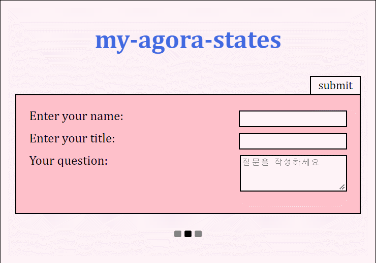
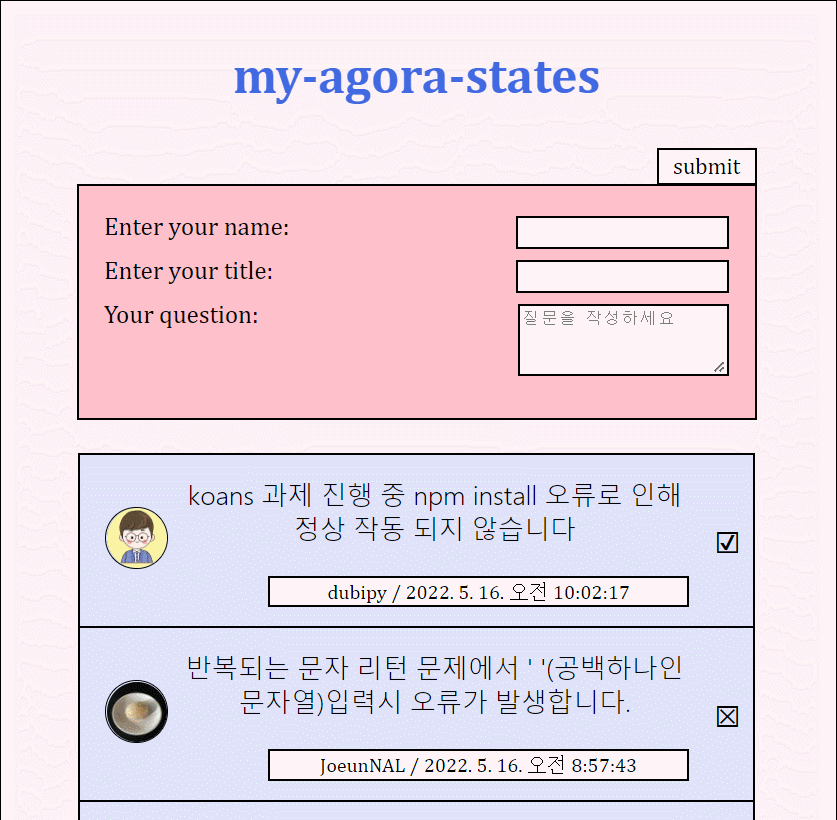

오늘 과제의 핵심은 server에서 데이터를 가져와 client에서 그 데이터를 보여주는 것이라고 생각한다. 

### server에서 데이터 가져오기 (fetch 사용)

```js
  const [ discussions , setDiscussions ] = useState([]);
  const [isLoading, setIsLoading] = useState(false);

  useEffect(()=> {
    setIsLoading(true);
    fetch('http://localhost:4000/discussions')
      .then((response) => response.json())
      .then((data)=> {
      setDiscussions(data)
      setIsLoading(false);
  })
  }, []);
```
처음 로딩화면을 실행하고, server에서 데이터를 가져오면 로딩화면을 보여주지 않게 작성했다.

```js
  return (
        {isLoading ? 
          <LoadingIndicator /> : <Discussions discussions={discussions}/> 
        }
  )
```

만약 `isLoading`이 **true**이면 `<LoadingIndicator />` 컴포넌트를 실행해 로딩 화면을 보여주고, **false**이면  `<Discussions />` 컴포넌트를 실행하여 discussion list를 보여준다.

#### 화면

**true**


**Result**

