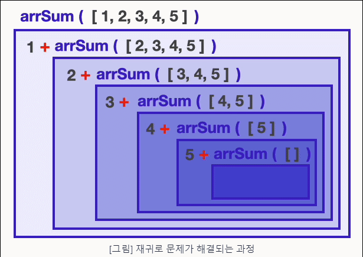

### 재귀(Recursion)
: 원래의 자리로 되돌아가거나 되돌아옴.

<br>

#### 예시
---

#### #1

```js
function arrSum(arr) {
  // base case : 문제를 더 이상 쪼갤 수 없는 경우 (재귀의 기초)
  if (arr.length === 0) {
    return 0;
  }

  // recursive case : 그렇지 않은 경우
  return arr[0] + arrSum(arr.slice(1));
}

arrSum([1,2,3,4,5]) //15
```

`arr[0]`은 첫 번째 요소, `arrSum(arr.slice(1))`은 첫 번째 요소를 제외하고 자기 자신을 호출을 반복한다. 

그 결과, `1 + [2,3,4,5]`, `2 + [3,4,5]`, `3 + [4,5]`, `4 + [5]`, `5 + [ ]`가 되어 `arr.length === 0`에 속해 `0`을 반환하면 `5 + 0` , `4 + 5`, `3 + 9`, `2 + 12`, `1 + 14`해서 최종적으로 `15`가 나온다.



이 그림을 보니까 더 잘 이해가 되는 것 같다.


#### #2

```js
// factorial 문제
function factorial(n) {
    if(n ===1){
        return 1;
    }
    return n * factorial(n-1);
}

fac(4) // 24
```

`return 4 * fac(3)`, `return 3 * fac(2)`, `return 2 * fac(1)`이 되고, `fac(1)`은 `1`이기 때문에 다시 그 결과를 거슬러 올라가면 `2 * 1`, `3 * 2`, `4 * 6`해서 최종적으로 `24`가 나오게 된다.

이것이 재귀 함수이다.

<br>

### 코플릿

오늘 재귀 코플릿을 풀면서 어려웠던 문제들이 많았다. 헷갈렸던 문제들을 다시풀어보고 풀이하도록 하겠다.

#### 02_isOdd
---

```js
function isOdd(n) {
    // 만약 0이면 짝수
    if(n === 0){
        return false;
    }
    // 만약 1이면 홀수
    if(n === 1){
        return true;
    }
    // 먄약 n이 음수이면 양수로 변환
    if(n < 0>){
        return isOdd(-num)
    }
    return isOdd(n-2);
}

let output = isOdd(17);
console.log(output); // --> true

output = isOdd(-8);
console.log(output); // --> false
```

<br>

#### 08_drop
---

```js
function drop(n, arr) {
    if(n === 0 || arr.length === 0){
        return arr;
    }
    return drop(n-1, arr.slice(1))
}

let output = drop(2, [1, -2, 1, 3]);
console.log(output); // --> [1, 3]

output = drop(5, [1, -2, 1, 3]);
console.log(output); // --> [ ]
```

`n`이 작아지면서 `arr`는 첫 번째 요소를 제외하고 자기 자신을 호출한다.

<br>

#### 09_take
---

```js
function take(n, arr) {
    // n이나 배열이 0인 경우 빈 배열을 리턴한다.
    if(n === 0 || arr.length === 0){
        return [ ];
    }
    return [arr[0]].concat(take(num-1, arr.slice(1)));
}

let output = take(2, [1, -2, 1, 3]);
console.log(output); // --> [1, -2]

output = take(5, [1, -2, 1, 3]);
console.log(output); // --> [1, -2, 1, 3]
```

`[1].concat(take(1, [-2, 1, 3]))`, `[-2].concat(take(0, [1, 3]))`해서 `n`이 0이기 때문에 빈 배열을 리턴한다.

다시 정리하면, `[-2].concat([ ]) = [-2]`, `[1].concat([-2]) = [1, -2]`해서 최종적으로 `[1, -2]`가 나온다.

<br>

#### 12_reverseArr
---
```js
function reverseArr(arr) {
    // 배열이 0인 경우 빈 배열을 리턴한다.
    if(arr.length === 0){
        return [];
    }
    //
    return [arr[arr.length -1]].concat(reverseArr(arr.slice(0, arr.length -1)));
}

let output = reverseArr([1, 2, 3]);
console.log(output); // --> [3, 2, 1]
```

`[3].concat(reverseArr([1,2]))`, `[2].concat(reverseArr([1]))`, `[1].concat(reverseArr([ ]))`가 되고 배열이 0인 경우 빈 배열을 리턴한다. 

다시 정리하면, `[1].concat([ ]) = [1]`, `[2].concat([1]) = [2, 1]`, `[3].concat([2, 1]) = [ 3, 2, 1 ]`해서 최종적으로 `[3, 2, 1]`가 된다.

<br>

#### 15_flattenArr
---

```js
function flattenArr(arr) {
    // 배열이 0인 경우 빈 배열을 리턴한다.
    if(arr.length === 0){
        return [];
    }

    //배열 안이 배열인 경우 재귀 함수를 통해 1차원 배열로 변환한다.
    if(Array.isArray(arr[0])){
        return flattenArr([...arr[0], ...arr.slice(1)]); // 전개 연산자
    }
    return [arr[0]].concat(flattenArr(arr.slice(1)));
}

let output = flattenArr([[1], 2, [3, 4], 5]);
console.log(output); // --> [1, 2, 3, 4, 5]

output = flattenArr([[2, [[3]]], 4, [[[5]]]]);
console.log(output); // --> [2, 3, 4, 5]
```

`flattenArr([1, [2, [3, 4], 5]])`, `[1].concat(flattenArr([2, [3, 4], 5]))`, `[2].concat(flattenArr([[3, 4], 5]))`,
`flattenArr([3, 4, [5]])`, `[3].concat(flattenArr([4, [5]]))`, `[4].concat(flattenArr([5]))`, 
`flattenArr([5, [ ]])`하고 배열이 0인 경우 빈 배열을 리턴한다.

`[5]`, `[4].concat([5]) = [4, 5]`, `[3].concat([4, 5]) = [3, 4, 5]`, `[2].concat([3, 4, 5]) = [2 ,3, 4, 5]`, `[1].concat([2 ,3, 4, 5]) = [1, 2, 3, 4, 5]`해서 최종적으로 `[1, 2, 3, 4, 5]`가 나온다.

###

**참고)**

**전개 연산자**`( ... )`를 사용하여 명시적으로 할당되지 않은 나머지 배열 값들을 사용할 수 있다.

```js
[a1, a2, ...rest_a] = [1, 2, 3, 4, 5, 6, 7, 8, 9];
console.log(a1); // 1
console.log(a2); // 2
console.log(rest_a); // [3, 4, 5, 6, 7, 8, 9]
```

