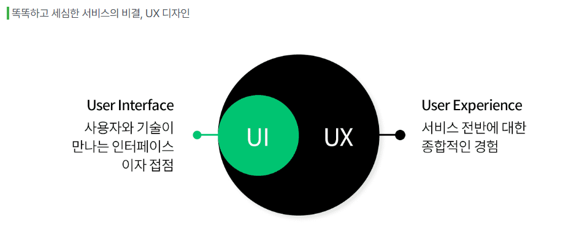
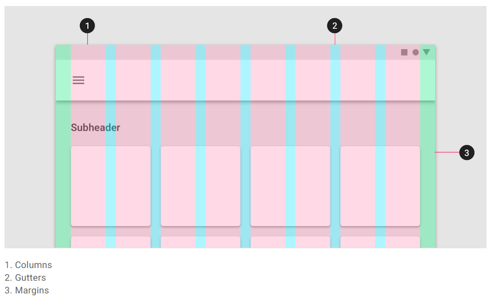

#### 중요한 키워드
---

면접 단골 질문이다. 프론트엔드 개발자는 UX를 잘 알아야 한다.

- UI
- UX
- UI와 UX의 차이점

#### UI
---

UI(User Interface, 사용자 인터페이스)는 사람들이 컴퓨터와 상호 작용하는 시스템을 의미한다.

#### UX
---

UX(User Experience, 사용자 경험)의 사전적 의미는 사용자가 어떤 시스템, 제품, 서비스를 직•간접적으로 이용하면서 느끼고 생각하는 총체적 경험이다.

#### UI와 UX의 관계
---

UX는 UI를 포함합니다. 또한 좋은 UX가 좋은 UI를 의미하거나, 좋은 UI가 항상 좋은 UX를 보장하지는 않는다.

 

### UI 디자인 패턴

#### 모달 (Modal)
---

모달은 기존에 이용하던 화면 위에 오버레이 되는 창을 뜻한다. 

#### 캐러셀 (Carousel)
---

캐러셀은 자동으로 돌아가거나, 사용자가 옆으로 넘겨야만 넘어가거나, 아니면 둘 중 선택할 수 있도록 만들 수 있다.

#### GNB (Global Navigation Bar), LNB (Local Navigation Bar)
---

탭 형식으로 최상단에 위치한 메뉴가 GNB, 마우스를 올렸을 때 드롭다운 형식으로 내려오는 서브 메뉴가 LNB이다.

 

### UI 레이아웃

#### 그리드 시스템 (Grid System)
---

Column 사이의 공간으로, 콘텐츠를 구분하는데 도움을 준다. Gutter의 간격이 좁을수록 콘텐츠들이 연관성 있어 보이고, 넓을수록 각 콘텐츠가 독립적인 느낌을 준다.

 

### 🎄 Figma